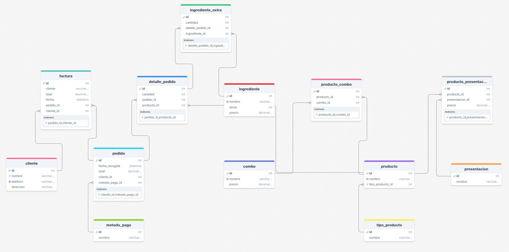

# 📦 Base de Datos - Pizza Fiesta

Este proyecto define la estructura de una base de datos relacional para el sistema de gestión de pedidos de **Pizza Fiesta**, una pizzería que ofrece productos individuales y combos.

## 📊 Estructura de la Base de Datos

La base de datos incluye las siguientes tablas:

- **cliente**: Información de los clientes.
- **producto**: Productos disponibles en la pizzería.
- **combo**: Combos promocionales ofrecidos.
- **detalle_pedido**: Detalles de productos incluidos en cada pedido.
- **factura**: Información de las facturas generadas.
- (puedes añadir más según el archivo completo...)

## 🖼️ Diagrama de Tablas

## 🚀 Uso

1. Abre tu gestor de base de datos MySQL.
2. Ejecuta el archivo `estructura.sql`.
3. ¡Listo! La base de datos estará creada y lista para insertar datos o desarrollar una aplicación.

## 🛠️ Tecnologías

- **MySQL**: Sistema de gestión de bases de datos relacional.

---

